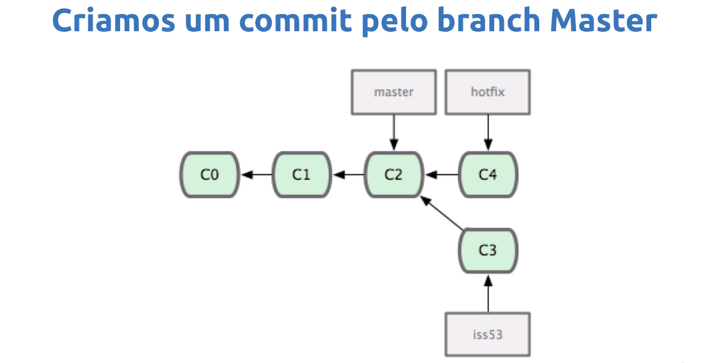
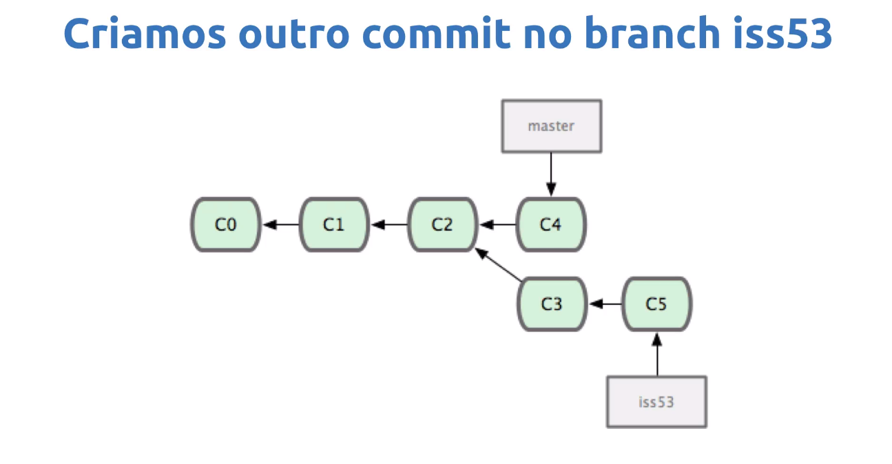

## Merge ##

### Estado inicial ### 
> No exemplo temos 3 commits e 2 braches, sendo no commit `C2` a branch `master` e `iss53` apontam para ele

### Criamos um commit na nova branch ###
> Então criar um novo commit `C3`

### Criamos um commit pela branch master ### 
> Agora então foi criado um novo commit pela branch master `C4` criando uma ramificação

### Criamos agora um novo commit na branch iss53 ###
> Agora criamos um commit `C5` na branch `iss53` 

### Fazendo o merge ###
> Criar um commit novo `C6` deixando novamente linear o histórico de commit em forma de diamante sendo `C6` resultado de `C3` `C5` e `C4` 

### Pro ### 
* Operação não destrutiva 

### Contra ###
* Commit extra 
* Histórico poluído (formato diamante)
